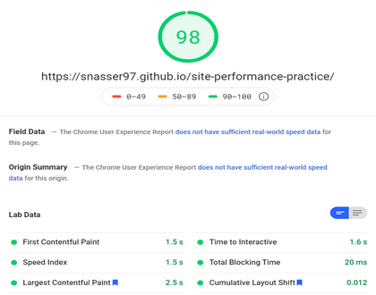
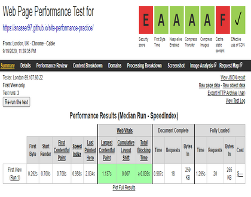
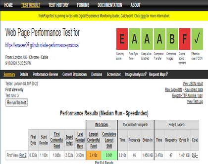

# Site performance practice

## [Test or view here](https://snasser97.github.io/site-performance-practice/)
Exercise in improving keiko corp site performance (Udemy).

<em>For those following the exercise I hope this helps you out</em>

### Table of contents

<a href="#methods">How to achieve good optimisation</a>

<a href="#after">Site speed - AFTER</a>

<a href="#before">Site speed - BEFORE</a>

  
<strong>Key notes:</strong>
<ul>
  <li>Skip the `bootstrap.css` file when using purify css - it will remove the arrow icons/mess testiomonials layout. <strong>Though you can still minify it with no issues</strong></li>
  <li>Added a label to the email subscribe section + alt descriptions to images to improve accessbility score</li>
  <li>If you wanted to, you could serve only 1 image sprite</li>
</ul>
 
<strong id="methods">Here are the steps I took:</strong>
<ul>
  <li>Check and removed unused <a href="https://purifycss.online/">PurifyCSS</a> for each css file being loaded</li>
  <li>Minified the CSS + JS files into one file as bundle.js and styles.css</li>
  <li>Resize + serve hero image for large, med and small devices using media queries</li>
  <li>Serve only ".woff" fonts (based on caniuse.com though personal choice)</li>
  <li>Preload fonts and styles.css</li>
  <li>Preload and execute bundle.js async</li>
  <li>Create css sprite sheet for some icons - serve only 1 image for multiple icons <a href='https://www.giftofspeed.com/sprite-generator/'>css sprite gen site</a>:
    <ul>
      <li>Make sprite for social images</li>
      <li>Make sprite for company logo (yahoo, google..)</li>
      <li>Make sprite for icons near iphone</li>
      <li>Make sprite for icons features</li>
      <li>Make sprite for logo icons (footer)</li>
    </ul>
  </li>
  <li>Resize + compress images, icons</li>
</ul>

<h2 id="after">pageSpeed Insights (after) 🚀</h2>

### Desktop

### Mobile

## webPageTest (after) 🚀

<h2 id="before"> pageSpeed Insights (before) ⏳</h2>

### Desktop

### Mobile

## webPageTest (before) ⏳

